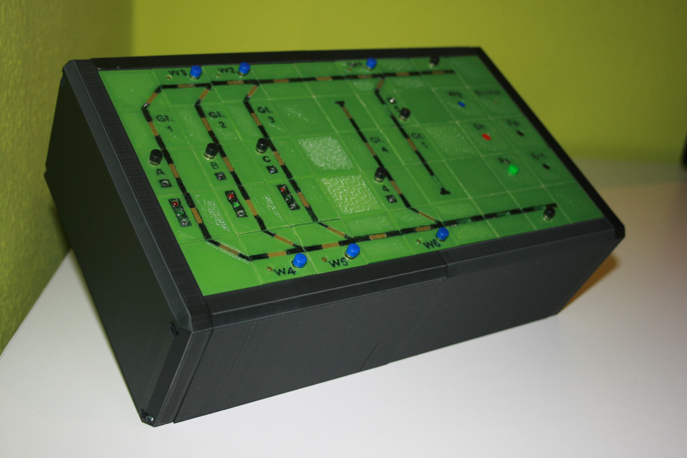

 ESTW
======
Das ist der Arduino Code und die App für meine Modelleisenbahnsteuerung

[ESTW Foto-Album](https://photos.app.goo.gl/BcrruCCMoLmwhqbK6/ "sieh dir Fotos von dem Projekt und den Projektideen an")

Projekt seit Juni 2018

 Stellpult
===========
Für die andere hälfte der Modelleisenbahn gibt es ein Stellpult. Die "Kästchen" sind mit dem 3D-Drucker gedruckt und werden mit WS2811 ICs angesteuert.

Update:
------------
Das Stellpult hat jetzt eine Vollständige Umrahmung (auch 3D gedruckt)

